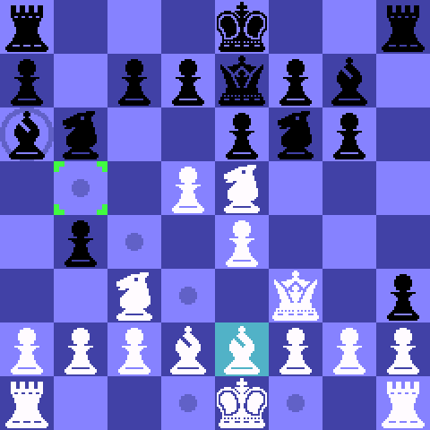

# TiChess

Project to write a chess engine for the TI-84 Plus CE.

As of August 2026, the move generator has been completed and passed perft tests on 125 positions to a depth of 5.

## Download

Not available because there isn't a game built around the engine yet.

## Building

This project uses [fasmg](http://flatassembler.net/) for the assembler.

To build use the command `fasmg src\tichess.asm path\to\bin\file.8xp`.
